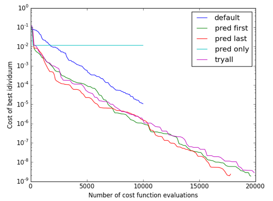

# InformedDifferentialEvolution

[](https://travis-ci.org/rened/InformedDifferentialEvolution.jl)
[](http://pkg.julialang.org/?pkg=InformedDifferentialEvolution&ver=0.5)

This package implements the simplest version of Differential Evolution, but adds the ability to specify custom 'predictors', which allow to incorporate knowledge about the problem into the optimization. 

For example, standard machine learning approaches could be trained on a set of examples of the optimization problem, and their predictions can be used to guide the optimization.

The key idea of Differential Evolution, without the additions of mutations and crossovers, is to evolve a population of candidates to the optimum by:

* selecting 3 random candididates `a`, `b`, `c`
* comparing the costs of `a` and `a' = a + lambda * (c-b)`
* replacing `a` with `a'` if `a'` has lower cost

Predictors allow to compare `a` not only to `a'`, but also to one or more hypotheses `a'' = predict(a)`. Predictions are computed for the entire population at once, so the signature of a predictor is actually `predictor(currentgeneration, currentcosts)`.


## Without predictors

```jl
optimum = [-2 4]'
costf(x) = (r = sqrt(sum((x-optimum).^2)); sin(r)^2+r/2)

best, info = de(costf, [-10,-10], [10,10])
@show optimum best optimum-best
```
`de` has the following signature:
```jl
de(costfunction, minima, maxima; kargs...)
```
The `costfunction` is expected to take a single parameter of type `Array{Number,2}` and return a scalar value. 
`minima` and `maxima` are arrays of type `Array{Number,2}` specifing the possible range of values passed to `costfunction`.

The optimization process can be controlled through the following keyword arguments of `de`, listed with their default values:
* `npop = 100`, number of candidates in the population
* `maxiter = 1e6`, maximum number of iterations
* `lambda = 0.85`, value of `lambda` used in the default DE predictor (see above)
* `initpop = mi .+ rand(length(mi), npop) .* (ma - mi)`, initial population
* `recordhistory = false`, record details about each candidates' evolution
* `continueabove = -Inf`, stop when the cost of the best candidate reaches this value
* `replaceworst = 0.0`, percentage specified as range `0.0 ... 1.0`. In each iteration this percentage of candidates is replaced with copies of the best candidates
* `roundto = 1e-6`, size of the grid in the parameter space where candidates live. Set to `0` for full numerical precision. Can also be a vector the size of `minima` / `maxima`, in which case the grid resolution can be different for each parameter. E.g. to enforce integers set to `1`

## With predictors

In this example we assume that we can learn from a couple of examples in a training phase and use the resulting model in our predictor:

```jl
# example predictor which learned to predict offsets
predictor(pop, costs) = pop + predict(somemodel, pop)

best, info = de(costf, [-10,-10], [10,10], {predictor, :default})
```

There is a helper function available to compare different strategies:

```jl
using InformedDEHelpers, PyPlot
analyze(f, mi, ma, [
	("default", {:default},{}),
	("pred first", {predictor, :default}, {}),
	("pred last", {:default, predictor}, {}),
	("pred only", {predictor}, {}),
	("tryall", {predictor, :default}, {(:tryallpredictors,true)})
])
```




## News

#### master

* fixed broken rounding and clamping

